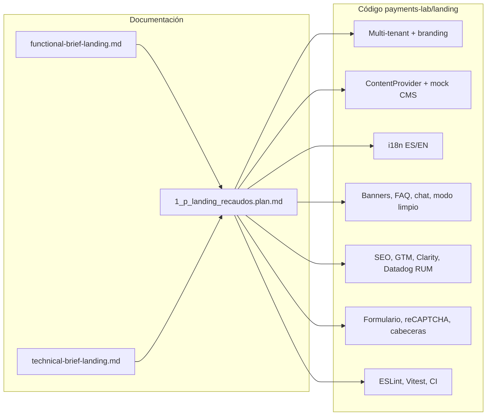

# PoC — Landing plataforma de recaudos

Repositorio de **prueba de concepto** para la landing de una plataforma de recaudos: documentación de negocio y plan de implementación en [`payments-lab/briefs/`](payments-lab/briefs/), y la aplicación entregable en [`payments-lab/landing/`](payments-lab/landing/).

La documentación **técnica de uso del código** (scripts, variables de entorno, arquitectura, integraciones, despliegue) está centralizada en el README del paquete de la landing:

**→ [Documentación técnica del proyecto (landing)](payments-lab/landing/README.md)**

---

## Tabla de contenidos

1. [Estructura del repositorio](#estructura-del-repositorio)
2. [Briefs y planificación](#briefs-y-planificación)
3. [Relación briefs ↔ implementación](#relación-briefs--implementación)
4. [Inicio rápido](#inicio-rápido)

---

## Estructura del repositorio

```text
landingRecaudos1/
├── README.md                      # Este archivo (visión general + briefs)
├── payments-lab/
│   ├── briefs/                    # Alcance funcional, técnico y plan por fases
│   │   ├── functional-brief-landing.md
│   │   ├── technical-brief-landing.md
│   │   └── 1_p_landing_recaudos.plan.md
│   └── landing/                   # Paquete Node: Vite, Tailwind, JS, tests
│       ├── README.md              # Detalle técnico de implementación
│       ├── package.json
│       ├── index.html
│       └── src/ …
└── .github/workflows/             # CI (lint + cobertura sobre payments-lab/landing)
```

---

## Briefs y planificación

Los **briefs** definen el *qué* y el *cómo* acordado antes de implementar; el [**plan**](payments-lab/briefs/1_p_landing_recaudos.plan.md) ordena el trabajo en fases y enlaza ambos briefs con la estructura de carpetas del código.

### Documentos disponibles

| Documento | Rol |
|-----------|-----|
| [**Functional brief**](payments-lab/briefs/functional-brief-landing.md) | Objetivos de producto y UX: plataforma de recaudos, marca blanca, secciones obligatorias (hero, servicios, beneficios, testimonios, contacto, footer), i18n ES/EN, banners, FAQ, chat IA opcional, modo limpio, observabilidad (SEO, GTM, Clarity, Datadog RUM), DoD funcional. |
| [**Technical brief**](payments-lab/briefs/technical-brief-landing.md) | Restricciones y arquitectura: HTML + JavaScript vanilla + Tailwind, component-first, multi-tenant por dominio, CMS headless, rendimiento, TDD, tests unitarios e integración, cobertura superior al 90 %, ESLint, JSDoc, sin frameworks SPA, formulario + reCAPTCHA, mitigación de clickjacking, cabeceras de seguridad. |
| [**Plan de implementación**](payments-lab/briefs/1_p_landing_recaudos.plan.md) | Roadmap por fases (scaffold, componentes, tenant/CMS, i18n, features, seguridad, observabilidad, calidad, accesibilidad), convenciones (`data-i18n-key`, hooks de marca, `ContentProvider`), diagrama de flujo de datos y nota sobre documentación/README. |

### Resumen orientado a negocio (functional brief)

- Landing **responsive** y perceptiblemente **premium, clara y cercana**, orientada a conversión: pagar, recomendar, referir, FAQs.
- **Marca blanca** para comercios; por defecto identidad **«Mi Compañía»** si no hay personalización.
- **Internacionalización** para pagadores en distintos mercados (mínimo español e inglés).
- **Banners** promocionales, **FAQ**, **widget de chat** (activable), **modo limpio** (vista tipo buscador + IA según diseño).
- **Observabilidad** explícita en el alcance: SEO, GTM, Clarity, Datadog RUM.

### Resumen orientado a ingeniería (technical brief)

- Stack fijo: **HTML, JS vanilla, Tailwind**; sin React/Vue/Angular; animaciones ligeras; carrusel simple sin dependencias pesadas.
- **Multi-tenancy** y **CMS headless** como extensiones obligatorias de diseño.
- **Calidad**: ESLint, cobertura alta, tests unitarios y de integración, código documentado con **JSDoc** / type hints.
- **Seguridad**: validación de formulario, reCAPTCHA, anti–clickjacking, **security headers** con calificación objetivo A o superior.

> **Nota del plan:** el documento de plan menciona una posible inconsistencia de copy («marca veterinaria premium» vs recaudos/fintech) en el brief funcional; conviene alinear posicionamiento en copy y tokens cuando se evolucione el diseño.

---

## Relación briefs ↔ implementación



Los briefs no sustituyen el README del paquete: el [**README de `landing`**](payments-lab/landing/README.md) describe comandos, variables `VITE_*`, flujos de montaje, integraciones y despliegue con el detalle que espera el technical brief.

---

## Inicio rápido

Desde la raíz del clon:

```bash
cd payments-lab/landing
npm install
npm run dev
```

Más opciones (`build`, `lint`, `test`, variables de entorno, simulación de tenants) en [**payments-lab/landing/README.md**](payments-lab/landing/README.md).
