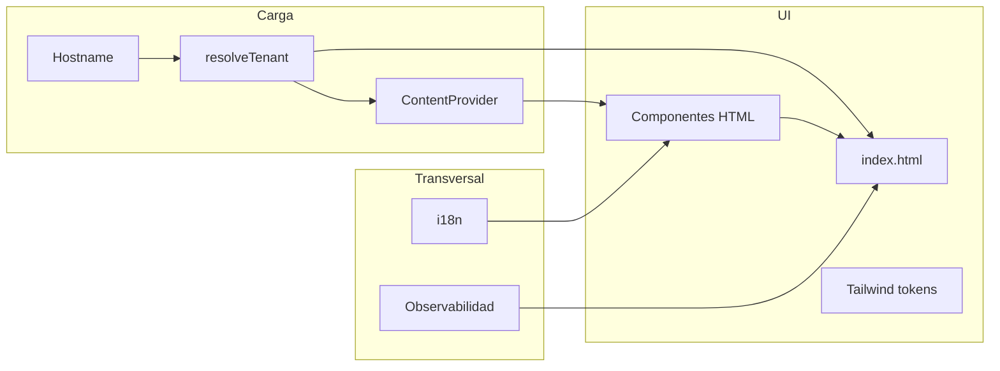

# Plan de implementación: landing plataforma de recaudos

## Contexto y alcance

- **Base tecnológica obligatoria:** HTML, JavaScript vanilla, TailwindCSS ([functional](payments-lab/briefs/functional-brief-landing.md), [technical](payments-lab/briefs/technical-brief-landing.md)).
- **Estado del repo:** No existe aplicación aún; la implementación vivirá bajo el proyecto (por convención se propone una carpeta dedicada, p. ej. `[payments-lab/landing/](payments-lab/landing/)` o la raíz de `payments-lab/`, según prefieras al ejecutar).
- **Inconsistencia de brief:** El DoD funcional menciona «marca veterinaria premium»; el resto del documento describe recaudos/fintech. Conviene **unificar el posicionamiento de marca** en el copy y tokens visuales antes o durante la primera iteración de UI.

---

## Orden de fases y convenciones (anti-reproceso)

- **Por qué la Fase 2 (componentes) precede a Fase 3 (tenant) y Fase 4 (i18n):** primero se fija **estructura semántica, layout, navegación y comportamientos** (dónde va cada bloque y qué JS lo activa). Después, los datos transversales **rellenan** esa estructura: tenant/CMS aportan marca y contenido; i18n aporta cadenas. Ese orden es coherente si la Fase 2 no cierra «copy definitivo» sin mecanismo de extensión.
- **Riesgo de reproceso:** si en Fase 2 se incrusta texto final en un solo idioma sin convenciones, Fases 3 y 4 obligan a **revisitar** los mismos HTML. Para evitarlo, desde Fase 2 se aplican **convenciones explícitas** (ver tabla siguiente). Así las fases posteriores son **relleno y cableado**, no rediseño completo.
- **Convenciones mínimas desde Fase 2**

| Convención | Propósito |
| ---------- | --------- |
| Nodos con `data-i18n-key` (o equivalente) para todo copy visible | Fase 4 solo mapea claves a `es.json` / `en.json` |
| Atributos o hooks para logo, hero, colores (p. ej. variables CSS o `data-brand`) | Fase 3 aplica `apply-branding` sin reescribir maquetación |
| Contenido repetible desde CMS: IDs o contenedores vacíos rellenados por `ContentProvider` | Fase 3 inyecta datos sin duplicar secciones por tenant |

---

## Fase 1 — Cimentación del proyecto y build

**Objetivo:** Tener un entorno reproducible con Tailwind compilado, HTML de entrada y scripts empaquetados o servidos de forma que el rendimiento sea controlable.

- Inicializar **Node/npm** con scripts de desarrollo y build (p. ej. Vite solo como bundler/dev server para Tailwind y assets, sin framework UI; alternativa mínima: PostCSS CLI + servidor estático).
- Añadir **TailwindCSS** (v3/v4 según stack elegido), **PostCSS** si aplica, y configuración para **purge/content paths** apuntando a todos los HTML y JS que contengan clases.
- Definir `**index.html`** como punto único de entrada en raíz del paquete de landing (cumple DoD funcional: `index.html`, estilos vía Tailwind, interacciones en JS).
- Estructura sugerida de salida: carpeta `dist/` o equivalente para despliegue; fuentes en `src/` para mantener orden.
- **Calidad desde el día uno (alineado a TDD del technical brief):** en esta misma fase añadir **ESLint** (flat config), **Vitest** con al menos un test de humo, y scripts `lint`, `test`, `test:coverage` en `package.json`. La Fase 8 no es el primer momento en el que existe herramientas de calidad; es la **consolidación** de cobertura y pruebas de integración.

**Archivos típicos a crear en esta fase**

| Crear                                               | Rol                                    |
| --------------------------------------------------- | -------------------------------------- |
| `package.json`                                      | Scripts dev/build/lint/test            |
| `tailwind.config.`*, `postcss.config.`* (si aplica) | Tokens, content paths, tema            |
| `vite.config.*` (opcional pero recomendado)         | Dev server, build, base path           |
| `eslint.config.js` (o equivalente)                  | Reglas base; ampliable en Fase 8       |
| `vitest.config.*`                                   | Cobertura y entorno de tests           |
| `.gitignore`                                        | `node_modules`, `dist`, caches         |
| `index.html` (en la raíz del paquete landing)       | Shell semántico y montaje de secciones |

**Modificar:** ninguno (proyecto nuevo).

**Lógica:** El build reduce CSS a lo usado, permite versionar assets y encaja con objetivos de rendimiento y ESLint en el código fuente.

---

## Fase 2 — Arquitectura «component first» sin framework

**Objetivo:** Reutilización y homogeneidad visual ([technical brief](payments-lab/briefs/technical-brief-landing.md)) sin React/Vue/Angular.

- Definir **contrato de componente**: cada pieza es un fragmento HTML reutilizable más un módulo JS opcional que inicializa comportamiento (menú, carrusel, acordeón FAQ).
- Implementación práctica:
  - **Fragmentos HTML** en algo como `src/components/<nombre>.html` o plantillas literales en JS si se prefiere inyección en cliente.
  - Un **orquestador** (p. ej. `src/js/app.js` o `main.js`) que importa/ensambla secciones en el DOM o que asume que `index.html` ya incluye partials vía build (si Vite/plugin de HTML partials).
  - **Design tokens** en Tailwind: colores tipográficos, radios, sombras para sensación «premium y cálida» sin depender de librerías de animación pesadas.

**Archivos a crear (ejemplos)**

| Crear                                                                                                            | Rol                                                   |
| ---------------------------------------------------------------------------------------------------------------- | ----------------------------------------------------- |
| `src/components/hero.html`, `services.html`, `benefits.html`, `testimonials.html`, `contact.html`, `footer.html` | Secciones mínimas del brief funcional                 |
| `src/components/banners.html`                                                                                    | Carrusel o franja promocional configurable            |
| `src/components/faq.html`                                                                                        | FAQs con acordeón accesible                           |
| `src/components/nav.html`                                                                                        | Navegación + menú móvil                               |
| `src/js/main.js`                                                                                                 | Bootstrap: montaje, listeners globales                |
| `src/js/ui/nav.js`                                                                                               | Menú responsive                                       |
| `src/js/ui/scroll-animations.js`                                                                                 | Animaciones ligeras al scroll (Intersection Observer) |
| `src/js/ui/testimonials.js`                                                                                      | Carrusel simple sin dependencias externas             |

**Modificar:** `index.html` para incluir landmark regions (`header`, `main`, `footer`), saltos de accesibilidad y puntos de montaje.

**Lógica:** Separar presentación en fragmentos facilita **marca blanca** (sustituir bloques o clases por configuración) y mantener **SOLID** (un módulo por responsabilidad: navegación vs i18n vs tema). **Tests:** por cada módulo nuevo de UI pura o comportamiento (nav, carrusel), añadir pruebas mínimas en la misma iteración cuando la lógica lo permita (p. ej. estado del menú, índice del carrusel).

---

## Fase 3 — Marca blanca y multi-tenancy

**Objetivo:** Misma base para «Mi Compañía» por defecto y para comercios; resolución por **dominio/subdominio** ([technical brief](payments-lab/briefs/technical-brief-landing.md)).

- **Configuración declarativa** (JSON o JS puro) por tenant: nombre comercial, logo, paleta (mapeada a clases CSS variables o data-attributes + Tailwind arbitrary values), imágenes hero, textos por defecto si no vienen del CMS, flags de features (banners, chat, modo limpio).
- **Resolución de tenant:** en build-time (variable de entorno) o runtime leyendo `window.location.hostname` y un mapa `hostname → config`; fallback a `default`.
- **Capa CMS headless:** interfaz abstracta `ContentProvider` con métodos del tipo «obtener landing content»; **implementación mock** con JSON local primero; luego adaptador real (Strapi, Contentful, etc.) sin tocar las vistas.

**Archivos a crear**

| Crear                                      | Rol                                      |
| ------------------------------------------ | ---------------------------------------- |
| `src/config/tenants/default.json`          | Marca «Mi Compañía»                      |
| `src/config/tenants/<tenant-id>.json`      | Ejemplos de comercio                     |
| `src/js/tenant/resolve-tenant.js`          | hostname → config                        |
| `src/js/tenant/apply-branding.js`          | Aplica CSS variables, logos, textos base |
| `src/js/cms/content-provider.js`           | Contrato                                 |
| `src/js/cms/mock-provider.js`              | Datos estáticos / JSON                   |
| `src/content/mock-landing.json` (opcional) | Contenido estructurado para el mock      |

**Modificar:** componentes HTML o el orquestador para leer datos del provider + tenant.

**Lógica:** Desacoplar **quién es el tenant** y **de dónde viene el contenido** evita acoplamiento y cumple extensibilidad hacia CMS real.

---

## Fase 4 — Internacionalización (i18n)

**Objetivo:** Español e inglés, conmutables y persistentes ([functional brief](payments-lab/briefs/functional-brief-landing.md)).

- Ficheros de traducción por idioma, p. ej. `src/i18n/es.json`, `src/i18n/en.json` con claves estables (`hero.title`, `cta.pay`, etc.).
- Módulo `i18n.js`: idioma inicial desde `localStorage`, query `?lang=`, o `navigator.language`; función `t(key)` y **actualización del DOM** (textContent de nodos marcados con `data-i18n-key` o re-render controlado de secciones).
- **Selector de idioma** en cabecera; anunciar cambio para lectores de pantalla.

**Archivos a crear**

| Crear                                                 | Rol                                    |
| ----------------------------------------------------- | -------------------------------------- |
| `src/i18n/es.json`, `src/i18n/en.json`                | Cadenas                                |
| `src/js/i18n/i18n.js`                                 | Carga, persistencia, aplicación al DOM |
| `src/js/i18n/locale-detector.js` (opcional, separado) | Detección inicial                      |

**Modificar:** todos los componentes con copy visible para usar claves o nodos traducibles.

**Lógica:** Un solo flujo de datos de strings evita duplicar HTML por idioma y escala a más locales.

---

## Fase 5 — Funcionalidades diferenciadoras (banners, FAQ, chat IA, modo limpio)

**Banners:** sección alimentada por lista en config/CMS (imagen, enlace, fechas de vigencia opcionales); rotación manual o carrusel simple.

**FAQ:** acordeón accesible (teclado, `aria-expanded`); contenido desde i18n o CMS.

**Chat IA widget:** flag en tenant; inyección de un contenedor flotante y script stub o integración real (URL/API en config). Si no hay backend en el PoC, **mock** que muestra panel y mensaje estático o endpoint configurable.

**Modo limpio:** toggle (header o preferencia); al activarse, **ocultar** el layout completo de la landing y mostrar un **lienzo minimalista** (campo + área de mensajes) con estilo «buscador»; el mismo shell `index.html` puede alternar clases en `body` o dos vistas hermanas. Desactivar animaciones pesadas en este modo para rendimiento.

**Archivos a crear**

| Crear                                                             | Rol                          |
| ----------------------------------------------------------------- | ---------------------------- |
| `src/js/features/banners.js`                                      | Render/rotación              |
| `src/js/features/faq.js`                                          | Acordeón                     |
| `src/js/features/chat-widget.js`                                  | Carga condicional del widget |
| `src/js/features/clean-mode.js`                                   | Toggle y swap de vista       |
| `src/components/clean-mode-view.html` (o sección en `index.html`) | UI modo limpio               |

**Modificar:** `main.js`, `tenant` config, estilos globales para estados `body.clean-mode`.

**Lógica:** Features opcionales van detrás de flags para no penalizar a tenants que no los contratan y mantener el núcleo liviano.

---

## Fase 6 — Formulario contacto / referidos y seguridad

**Objetivo:** Alinear con [technical brief](payments-lab/briefs/technical-brief-landing.md): validación básica, reCAPTCHA, mitigación clickjacking, cabeceras de seguridad.

- Formulario en sección contacto/referidos: validación en cliente (email, campos requeridos) con mensajes i18n.
- Integrar **reCAPTCHA v3 o v2** vía script oficial y verificación en backend cuando exista; en PoC, **documentar** claves y endpoint o usar entorno de prueba con mock de verificación en tests.
- **Clickjacking:** `X-Frame-Options: DENY` o `frame-ancestors` vía CSP en la configuración del servidor/hosting estático.
- **Security headers:** HSTS (si HTTPS), `X-Content-Type-Options`, CSP razonable para scripts propios y dominios de GTM/Clarity/Datadog/recaptcha.

**Archivos a crear**

| Crear                                                         | Rol                                                                   |
| ------------------------------------------------------------- | --------------------------------------------------------------------- |
| `src/js/forms/contact-form.js`                                | Validación y envío (fetch a API configurable)                         |
| `_headers` o `netlify.toml` / `vercel.json` / plantilla Nginx | Cabeceras en el entorno elegido                                       |
| `.env.example`                                                | IDs públicos (GTM, Clarity, Datadog, reCAPTCHA site key) sin secretos |

**Modificar:** `contact.html`, pipeline de despliegue.

**Lógica:** Seguridad y spam se abordan en capa HTTP + validación cliente; el plan debe nombrar **dónde** viven las cabeceras según el proveedor final de hosting.

---

## Fase 7 — Observabilidad y SEO

**Objetivo:** SEO, GTM, Clarity, Datadog RUM ([functional](payments-lab/briefs/functional-brief-landing.md) y [technical](payments-lab/briefs/technical-brief-landing.md) DoD).

- **SEO:** `title`, `meta description`, Open Graph/Twitter básicos, datos estructurados JSON-LD si aplica (`Organization` / `WebSite`), URLs canónicas, heading hierarchy.
- **GTM:** contenedor cargado de forma diferida según buenas prácticas; eventos dataLayer para CTAs clave (pagar, referir, cambio idioma).
- **Microsoft Clarity:** snippet condicionado por config (tenant puede desactivar).
- **Datadog RUM:** inicialización con `applicationId`, `clientToken`, `service`, `env`; en desarrollo usar **mock/no-op** o clave de test para no contaminar producción.

**Archivos a crear**

| Crear                                 | Rol                         |
| ------------------------------------- | --------------------------- |
| `src/js/observability/gtm.js`         | Push inicial y helpers      |
| `src/js/observability/clarity.js`     | Carga opcional              |
| `src/js/observability/datadog-rum.js` | Init RUM con JSDoc          |
| `src/js/observability/index.js`       | Orquesta según env y tenant |

**Modificar:** `index.html` (solo placeholders o un único bootstrap que inserte scripts tras consentimiento si más adelante hay CMP; el brief no exige CMP explícito).

**Lógica:** Centralizar telemetría evita duplicar snippets y facilita desactivar por tenant o entorno.

---

## Fase 8 — Calidad: consolidación ESLint, JSDoc, cobertura y pruebas integradas

**Objetivo:** Cumplir ESLint, cobertura >90%, unitarios e integración ([technical brief](payments-lab/briefs/technical-brief-landing.md)), sin contradecir TDD.

- **Qué va aquí vs en el resto del plan:** la **Fase 1** ya dejó ESLint y Vitest operativos; durante Fases 2–7 se **añaden tests junto al código** (TDD o inmediatamente después del módulo). Esta fase es el **cierre de calidad**: endurecer reglas JSDoc si faltó, subir cobertura global al umbral, suite de integración/e2e mínima, y opcionalmente CI.
- **ESLint** con parser adecuado para JS moderno; reglas que favorezcan JSDoc útil (`require-jsdoc` o validación de tipos vía `eslint-plugin-jsdoc`).
- **JSDoc** en funciones públicas y tipos en módulos (`@typedef` para `TenantConfig`, `ContentProvider`, etc.) cumpliendo «type hints» en el ecosistema JS.
- **Tests unitarios (Vitest):** tenant resolver, i18n, validación de formulario, toggles de modo limpio, parsers de CMS mock (completar huecos si alguna fase quedó por debajo del objetivo).
- **Tests de integración:** renderizado de `index` en jsdom o **Playwright** ligero para flujos: cambio de idioma, apertura menú móvil, FAQ, toggle modo limpio.
- Flujo **TDD:** ya aplicado por fase; aquí se valida que el conjunto cumple el DoD de cobertura y que no hay regresiones.

**Archivos a crear o completar**

| Crear / ajustar                      | Rol                      |
| ------------------------------------ | ------------------------ |
| `eslint.config.js` o `.eslintrc.cjs` | Reglas finales del proyecto |
| `vitest.config.js` (si Vitest)       | Umbrales de cobertura    |
| `tests/unit/**/*.test.js`            | Unitarios (ampliación)   |
| `tests/integration/**/*.spec.js`     | Integración / e2e mínimo |

**Modificar:** `package.json` scripts `lint`, `test`, `test:coverage`; añadir job CI si aplica.

**Lógica:** La UI pura puede tener menos cobertura; la lógica en módulos debe estar muy cubierta para alcanzar el umbral global sin tests frágiles de píxeles.

---

## Fase 9 — Accesibilidad, responsive y cierre DoD

- Revisión **mobile-first** de todas las secciones; touch targets; contraste.
- Focus visible, skip link, landmarks, etiquetas en formularios.
- **Lighthouse** (performance, accessibility, SEO) como checklist manual o CI opcional.

---

## Entregable de documentación (repo)

Los briefs no listan explícitamente un manual; igualmente es **entregable recomendado** para operación y onboarding:

- **`README.md`** (u homólogo en la raíz del paquete landing): instalación, `dev` / `build` / `preview`, variables de entorno (referencia cruzada con `.env.example`), cómo simular otro tenant en local (hosts / query), y dónde configurar cabeceras de seguridad según el hosting.
- Opcional: diagrama de arranque (tenant → CMS → UI) o sección «Arquitectura» breve si el equipo lo exige.

**Lógica:** el technical brief ya exige observabilidad, secretos no commiteados y despliegue con cabeceras; sin README mínimo esos requisitos son difíciles de reproducir para otro desarrollador o para DevOps.

---

## Diagrama de flujo de datos (alto nivel)

---

## Resumen: archivos principales

**Crear (lista consolidada):** configuración Node y Tailwind/Vite; `index.html`; biblioteca de componentes HTML bajo `src/components/`; módulos JS bajo `src/js/` (main, tenant, cms, i18n, ui, features, forms, observability); JSON de tenants e i18n; tests bajo `tests/`; configuración ESLint y Vitest (inicio en Fase 1, ajuste en Fase 8); archivos de cabeceras según hosting; `.env.example`; **`README.md`** con setup y operación.

**Modificar:** tras el bootstrap inicial, sobre todo `index.html`, `tailwind.config`, y los JSON de contenido/tenant a medida que se añaden comercios o idiomas.

**Nota de ejecución:** la implementación de código comienza cuando el equipo confirme; hasta entonces este documento es la referencia de alcance y orden.

---

## Historial de ajustes al plan

| Fecha      | Cambio |
| ---------- | ------ |
| 2026-03-28 | Añadida sección **Orden de fases y convenciones (anti-reproceso)**; Fase 1 ampliada con ESLint/Vitest desde el inicio; Fase 8 redefinida como **consolidación** de calidad (TDD repartido por fases); nueva sección **Entregable de documentación (README)**; resumen y frontmatter (`overview`, todos) alineados; cierre sustituye la nota obsoleta sobre «no generar código». |