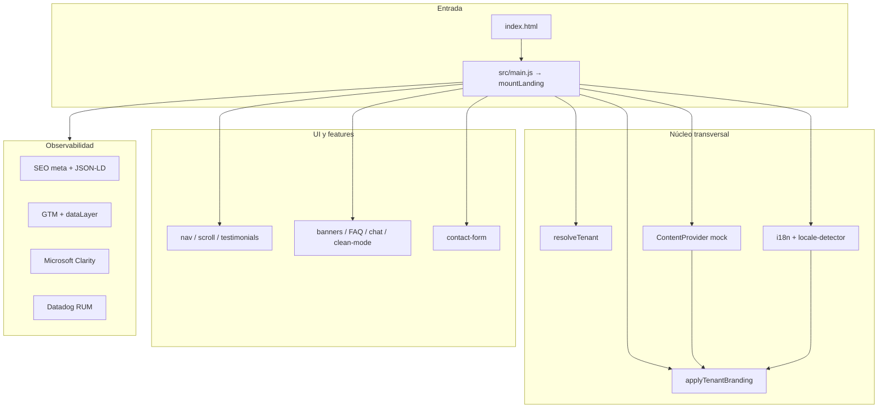
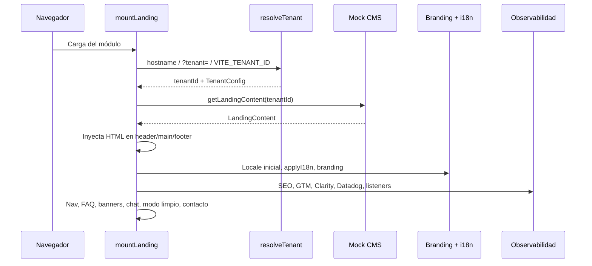
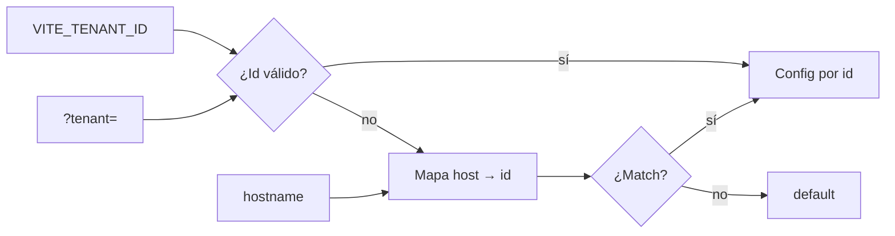
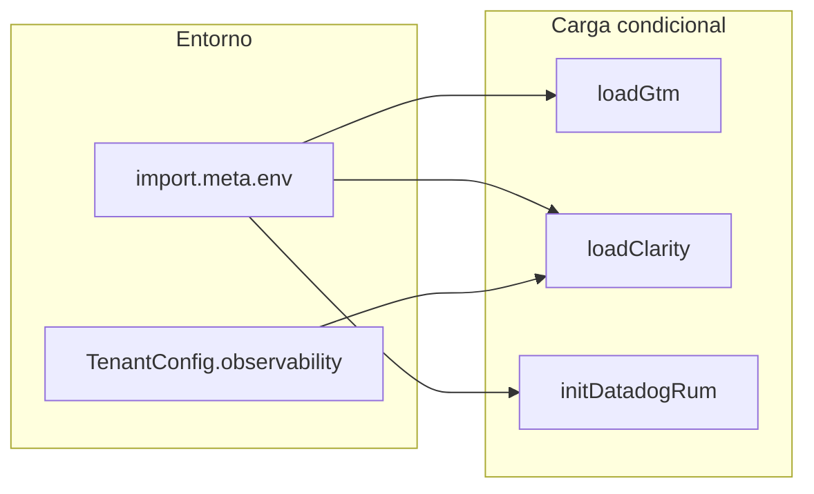

# Landing — Plataforma de recaudos

Aplicación web estática orientada a **marca blanca** y **multi-tenant**: una sola base de código sirve a distintos comercios o la marca por defecto, con textos en **español e inglés**, contenido extensible vía contrato **CMS**, telemetría opcional (GTM, Clarity, Datadog RUM) y calidad asegurada con ESLint, Vitest y umbrales de cobertura.

---

## Tabla de contenidos

1. [Arquitectura](#arquitectura)
2. [Stack tecnológico](#stack-tecnológico)
3. [Estructura del repositorio](#estructura-del-repositorio)
4. [Requisitos y puesta en marcha](#requisitos-y-puesta-en-marcha)
5. [Variables de entorno](#variables-de-entorno)
6. [Multi-tenant y marca blanca](#multi-tenant-y-marca-blanca)
7. [Internacionalización (i18n)](#internacionalización-i18n)
8. [Contenido y CMS](#contenido-y-cms)
9. [Integraciones y observabilidad](#integraciones-y-observabilidad)
10. [Formulario de contacto y reCAPTCHA](#formulario-de-contacto-y-recaptcha)
11. [Seguridad HTTP](#seguridad-http)
12. [Calidad, pruebas y CI](#calidad-pruebas-y-ci)
13. [Despliegue](#despliegue)

---

## Arquitectura

El **shell** es un único `index.html` que carga el bundle de Vite. El módulo `src/js/main.js` orquesta el montaje: resuelve tenant, obtiene contenido del proveedor mock, aplica branding, i18n, secciones HTML y módulos de UI (navegación, carruseles, FAQ, banners, chat, modo limpio, formulario y observabilidad).



**Flujo de arranque en cliente (simplificado):**



---

## Stack tecnológico

| Capa | Tecnología |
|------|------------|
| Marcado | HTML5 semántico, fragmentos en `src/components/*.html` importados como `?raw` |
| Estilos | **Tailwind CSS v4** (PostCSS), tokens de marca vía variables CSS `--brand-*` |
| Lógica | **JavaScript ES modules** (sin framework UI) |
| Bundler / dev | **Vite 6** (`dev`, `build`, `preview`) |
| Calidad | **ESLint 9** (flat config) + **eslint-plugin-jsdoc**; **Vitest** + **@vitest/coverage-v8**, jsdom |
| RUM | `@datadog/browser-rum` (carga condicional) |

---

## Estructura del repositorio

```
landing/
├── index.html                 # Punto de entrada único
├── package.json
├── vite.config.js
├── vitest.config.js
├── eslint.config.js
├── postcss.config.js
├── .env.example               # Plantilla de variables (no secretos)
├── public/
│   └── _headers               # Cabeceras para hosts estáticos compatibles (p. ej. Netlify)
├── nginx-security-headers.example.conf
├── src/
│   ├── main.js                # Importa CSS y delega en js/main.js
│   ├── style.css
│   ├── components/            # Fragmentos HTML reutilizables
│   ├── config/tenants/        # JSON por tenant (default, comercio-norte, …)
│   ├── content/               # mock-landing.json para el CMS mock
│   ├── i18n/                  # es.json, en.json
│   └── js/
│       ├── main.js            # Orquestación mountLanding
│       ├── tenant/            # resolve-tenant, apply-branding, typedefs
│       ├── cms/               # contrato, mock-provider, merge, apply-landing-content
│       ├── i18n/
│       ├── ui/                # nav, scroll-animations, testimonials
│       ├── features/          # banners, faq, chat-widget, clean-mode
│       ├── forms/             # contact-form
│       └── observability/     # gtm, clarity, datadog-rum, index
└── tests/
    └── integration/           # Pruebas de flujo en jsdom (p. ej. landing-flow.spec.js)
```

Los tests unitarios viven junto al código (`*.test.js`) y la integración bajo `tests/integration/`.

---

## Requisitos y puesta en marcha

- **Node.js** 20.x recomendado (compatible con 18+).
- **npm** (incluido con Node).

```bash
cd payments-lab/landing
npm install
cp .env.example .env            # opcional: rellenar IDs públicos
npm run dev                     # http://localhost:5173 (Vite)
npm run build                   # salida en dist/
npm run preview                 # sirve dist/ para validar producción local
npm run lint
npm test
npm run test:coverage
```

---

## Variables de entorno

Vite expone solo variables con prefijo **`VITE_`**. Copie `.env.example` a `.env` y ajuste. No commitear secretos: las claves listadas son **públicas** (site key reCAPTCHA, IDs de contenedor GTM, tokens RUM de cliente, etc.); la **clave secreta** de reCAPTCHA y la verificación del formulario deben residir en el **backend**.

| Variable | Uso |
|----------|-----|
| `VITE_CONTACT_FORM_ENDPOINT` | URL `POST` JSON `{ name, email, message, recaptchaToken? }` |
| `VITE_RECAPTCHA_SITE_KEY` | reCAPTCHA v3 (site key) |
| `VITE_GTM_CONTAINER_ID` | Google Tag Manager (`GTM-…`) |
| `VITE_CLARITY_PROJECT_ID` | Microsoft Clarity (puede desactivarse por tenant en JSON) |
| `VITE_DATADOG_*` | RUM: `APPLICATION_ID`, `CLIENT_TOKEN`, `SERVICE`, `ENV`, `SITE`, `ALLOW_IN_DEV` |
| `VITE_TENANT_ID` | Forzar tenant en build/desarrollo (véase resolución de tenant) |

Detalle en comentarios dentro de `.env.example`.

---

## Multi-tenant y marca blanca

Cada tenant es un **JSON declarativo** en `src/config/tenants/<id>.json`: nombre comercial, logo (iniciales), paleta (`colors` → variables CSS), flags de features (banners, chat, modo limpio), hostnames, SEO, etc. Los tipos documentados están en `src/js/tenant/tenant-config.js` (solo JSDoc).

### Resolución del tenant

Orden de precedencia (implementado en `resolve-tenant.js`):

1. `VITE_TENANT_ID` (si el id existe en el mapa interno).
2. Query `?tenant=<id>` (misma condición).
3. **Hostname** en minúsculas contra la lista `hostnames` de cada JSON.
4. Fallback **`default`**.



### Probar otro tenant en local

- **Query:** `http://localhost:5173/?tenant=comercio-norte` (ajuste el id según los JSON disponibles).
- **Variable:** `VITE_TENANT_ID=comercio-norte` en `.env`.
- **Hosts:** añada en `/etc/hosts` un hostname listado en el JSON del tenant y ábralo con el mismo puerto de Vite.

`apply-branding.js` aplica `data-brand`, variables CSS y textos dependientes del idioma donde corresponda.

---

## Internacionalización (i18n)

- Ficheros: `src/i18n/es.json`, `src/i18n/en.json`.
- El DOM usa nodos con `data-i18n-key` (y opcionalmente `data-i18n-attr` para atributos traducibles).
- Idioma inicial: detector local (`locale-detector.js`) — almacenamiento, `?lang=`, `navigator`.
- Cambio de idioma: selector en cabecera; se dispara evento interno y se re-aplican branding y textos donde aplica.

---

## Contenido y CMS

- **Contrato:** `ContentProvider` con `getLandingContent(tenantId)` → `LandingContent` (slots, `bannerItems`, etc.), definido en `src/js/cms/content-provider.js`.
- **Implementación actual:** `mock-provider.js` mezcla `content/mock-landing.json` (base + bloques por tenant) mediante `merge-landing-content.js`.
- **Inyección:** `apply-landing-content.js` rellena slots `data-cms-slot` en el documento.

Un proveedor real (Strapi, Contentful, …) puede sustituir el mock sin cambiar los componentes si respeta el mismo contrato.

---

## Integraciones y observabilidad

Centralizadas en `src/js/observability/index.js`: SEO (título, meta, canonical, JSON-LD Organization/WebSite), GTM, Clarity, Datadog RUM y listeners de `dataLayer` (p. ej. CTAs, cambio de idioma).



| Integración | Comportamiento |
|-------------|----------------|
| **GTM** | Si `VITE_GTM_CONTAINER_ID` está definido, se carga el contenedor y se empujan eventos al `dataLayer`. |
| **Clarity** | Si hay `VITE_CLARITY_PROJECT_ID` y el tenant no desactiva Clarity (`observability.clarity: false`), se inyecta el script. |
| **Datadog RUM** | Requiere `applicationId` y `clientToken`. En modo `development` / `test` **no** inicializa el SDK salvo `VITE_DATADOG_ALLOW_IN_DEV=true`, para no contaminar métricas. |

---

## Formulario de contacto y reCAPTCHA

- Validación en cliente (`validateContactInput`) con mensajes i18n.
- Si `VITE_RECAPTCHA_SITE_KEY` está definido, se intenta ejecutar reCAPTCHA v3 antes del envío (o inyección `executeRecaptcha` en tests).
- Con `VITE_CONTACT_FORM_ENDPOINT` vacío o `#`, tras validación se muestra mensaje de éxito tipo PoC sin `POST` remoto.
- Con URL válida, `POST` JSON; el **backend** debe verificar el token con la clave **secreta** de Google.

---

## Seguridad HTTP

La aplicación es estática: **cabeceras** deben configurarse en el **CDN / hosting** (Netlify `_headers`, Nginx, CloudFront, Vercel, etc.).

- **`public/_headers`**: ejemplo listo para Netlify — `X-Frame-Options`, CSP, HSTS, `frame-ancestors`, permisos, etc., incluyendo dominios usados por scripts de Google, GTM, Clarity y Datadog según el proyecto.
- **`nginx-security-headers.example.conf`**: plantilla para servidores Nginx.

Revise la **Content-Security-Policy** si añade nuevos orígenes de scripts o APIs.

---

## Calidad, pruebas y CI

| Comando | Descripción |
|---------|-------------|
| `npm run lint` | ESLint sobre el árbol de fuentes |
| `npm test` | Vitest (unitarios + integración jsdom) |
| `npm run test:coverage` | Igual con informe v8 y umbrales configurados en `vitest.config.js` |

- **Unitarios:** `*.test.js` junto a los módulos.
- **Integración:** `tests/integration/` (p. ej. montaje completo, idioma, menú, FAQ, modo limpio).

En el repositorio padre existe un workflow **GitHub Actions** (`.github/workflows/landing-ci.yml`) que, ante cambios bajo `payments-lab/landing/`, ejecuta `lint` y `test:coverage`.

---

## Despliegue

1. `npm run build` → artefactos en **`dist/`**.
2. Servir `dist/` como sitio estático con las **cabeceras de seguridad** adecuadas.
3. Definir variables de entorno en el pipeline de build (prefijo `VITE_`) para cada entorno (staging/producción).
4. Opcional: `base` en Vite si la app no se publica en la raíz del dominio.

---

## Licencia y documentación de negocio

Los briefs funcionales y técnicos del producto viven en `payments-lab/briefs/`; este README describe la **implementación** del paquete `landing`.
